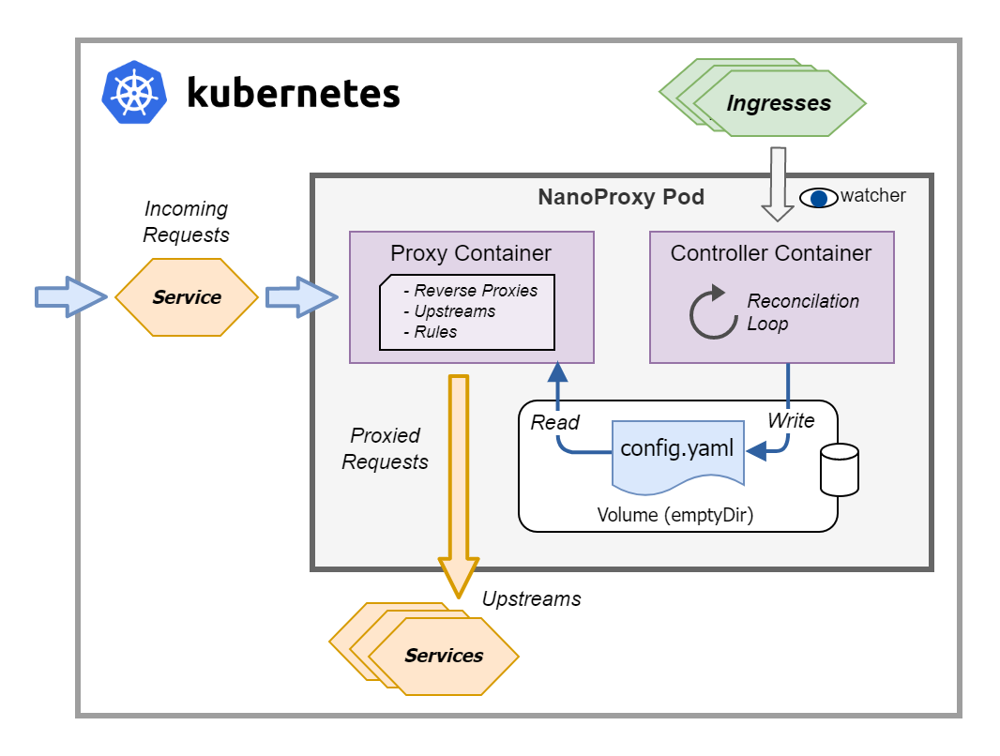

# NanoProxy

NanoProxy is a simple HTTP reverse proxy & Kubernetes ingress controller written in Go and based largely on [httputil.ReverseProxy](https://pkg.go.dev/net/http/httputil#ReverseProxy) in the Go standard library. This was developed as a learning exercise only! If you want an ingress controller for your production Kubernetes cluster you [should look elsewhere](https://kubernetes.io/docs/concepts/services-networking/ingress-controllers/).

Features:

- Host and path based routing, with prefix and exact matching modes.
- Can run as a Kubernetes ingress controller, using the core `Ingress` resource and utilizes the sidecar pattern.
- Strip path support, removes the matching path before sending on the request.
- Preserves the host header for the upstream requests, like [any good reverse proxy should](https://learn.microsoft.com/en-us/azure/architecture/best-practices/host-name-preservation).
- The headers `X-Forwarded-For`, `X-Forwarded-Host`, `X-Forwarded-Proto` are set on the upstream request.
- TODO: TLS support & termination.

### Container Images

Prebuilt containers are published on GitHub Container Registry

[](https://github.com/benc-uk/nanoproxy/pkgs/container/nanoproxy-proxy)
[](https://github.com/benc-uk/nanoproxy/pkgs/container/nanoproxy-controller)

### Project Status


## ☸️ Deploying to Kubernetes

🔥 TODO: Better docs

Example manifests are provided to deploy to Kubernetes as
- A standalone reverse proxy 

🔥 TODO: Helm docs

## 🐋 Running the proxy as container

You can simply run:

```bash
docker run -p 8080:8080 ghcr.io/benc-uk/nanoproxy-proxy:latest
```

But this isn't very helpful, as you will be running with an empty configuration!
To mount a local folder containing a config file locally, try the following:

```bash
docker run -p 8080:8080 \
-v $PATH_TO_CONF:/conf \
-e CONF_FILE=/conf/config.yaml \
ghcr.io/benc-uk/nanoproxy-proxy:latest
```

## 🎯 Ingress Controller

The ingress controller (or just controller) works by listening to the Kubernetes API and watching for `Ingress` resources. It then reconciles each `Ingress` using an in memory cache (simply a map keyed on namespace & name) and the following logic:

1. Detect if the action is a deletion, if *Ingress* matches one in the cache and has been removed from Kubernetes, if so remote it from the cache.
2. Check the *Ingress* has an `ingressClassName` in the spec, matching by name an *IngressClass*, and this *IngressClass* resource matches our controller ID `benc-uk/nanoproxy`. Exit if there is no match.
3. Add the *Ingress* to the cache or update existing one based on key.
4. Build NanoProxy configuration from cache, mapping fields from the *Ingress* spec into upstreams and rules (see [proxy config below](#🛠️-proxy-config)).
5. Write configuration file.

The controller needs to run as a sidecar beside the proxy, this is achieved by running both containers in the same pod, and using a shared volume so the config file written by the controller is picked up by the proxy. This is best explained with a diagram:



The controller was created using the Operator SDK, roughly following [this guide](https://kubernetes.io/blog/2021/06/21/writing-a-controller-for-pod-labels/)

### Ingress Controller - Annotations

The following annotations are supported:

- `nanoproxy/backend-protocol` - Specify 'http' or 'https', default is 'http'
- `nanoproxy/strip-path` - Strip the path, 'true' or 'false', see proxy config below. Note this will apply to all rules/routes under this *Ingress*, create multiple *Ingresses* if you need a mix. Default is 'false'

## 🛠️ Proxy Config

NanoProxy configuration is done with YAML and consists of arrays of two main objects, `upstreams` and `rules`. Upstreams are the target servers you want to send requests onto. Rules are routing rules for matching requests and assigning them to one of the upstreams.

The proxy process watches the config file for changes and will reload the configuration if the file is updated.

> Note. When running as an ingress controller you do not supply a config file, as it is completely managed by the controller.

By default the file `./config.yaml` local to current directory of the binary, a different filename & path can be set with `-config` or `-c` argument when starting the proxy.

### Upstream

```yaml
name: Name
host: Hostname or IP
port: Port number, defaults to 80 or 443 when scheme is https
scheme: Scheme 'http' or 'https', if omitted defaults to 'http'
```

### Rule

```yaml
upstream: Name of the upstream to send traffic to
path: URL path in request to match against
host: Host in request to match against. If omitted, will match all hosts
matchMode: How to match the path, 'prefix' or 'exact', defaults to 'prefix'
stripPath: Remove the path before sending to upstream, true/false, defaults to false
```

Example config

```yaml
upstreams:
  - name: my-server-a
    host: some.hostname.here
    scheme: https
  - name: my-server-b
    host: backend.api.example
    port: 3000

rules:
  - upstream: my-server-b
    path: /api
    stripPath: true
  - upstream: my-server-a
    path: /
    host: proxy.example.net
```

## ⚙️ Environmental Vars

- `CONF_FILE`: This is used by both the proxy and the controller to set the path of the config file used.
- `TIMEOUT`: Connection and HTTP timeout used by the proxy.
- `PORT`: Port the proxy will listen on

## 🤖 Routing and matching logic

## 🧑‍💻 Developer Guide

It's advised to use the published container image rather than trying to run from source, but if you wish to try running the code yourself, here's some getting started details

### Pre-requisites

- Go 1.20+
- Bash and make
- Docker or other container runtime engine

The makefile should help you carry out most tasks. Linters and supporting tools are installed into a local `.tools` directory. Run `make install-tools` to download and set these up.

Then use `make run-proxy` or `make run-ctrl` to run either or both locally.

```
$ make
help                 💬 This help message :)
install-tools        🔮 Install dev tools into project bin directory
lint                 🔍 Lint & format check only, sets exit code on error for CI
lint-fix             📝 Lint & format, attempts to fix errors & modify code
build                🔨 Build binary into ./bin/ directory
images               📦 Build container images
push                 📤 Push container images
run-proxy            🌐 Run proxy locally with hot-reload
run-ctrl             🤖 Run controller locally with hot-reload
test                 🧪 Run all unit tests
clean                🧹 Clean up, remove dev data and files
```

### Repo Index

```text
📂
├── build         - Docker build files
├── deploy
│   ├─ manifests  - Kubernetes manifests to deploy as ingress controller
│   └─ helm       - Helm chart to deploy as ingress controller
├── ingress-ctrl  - Source code of the ingress controller
├── pkg           - Shared packages between proxy and controller
├── proxy         - Source code of the reverse proxy
└── samples       - Samples and examples
```
